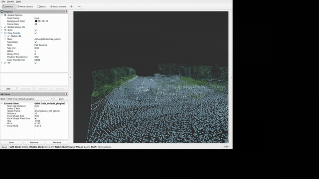

# DrivingStereo pseudo-point mapping demo

An ROS 2 Humble demo pipeline that turns DrivingStereo stereo image pairs into
filtered, colored pseudo-point clouds and accumulates them in RViz2.

## Demo



## Pipeline

```text
DrivingStereo left/right images
  -> PSMNet disparity
  -> learned pseudo-point filter
  -> ORB + stereo-depth PnP-RANSAC pose
  -> colored PointCloud2 + map-frame accumulation
  -> RViz2
```

The active mapping implementation is in
`ros2_ws/src/drivingstereo_pseudo_points`.

## Prerequisites

- Docker Desktop with NVIDIA GPU support.
- Windows X server such as VcXsrv, started on display `0`.
- DrivingStereo data at `./drivingstereo`.
- Model weights at `./ros2_ws/model_folder/`:
  - `psm_fly_correctlr_slicnormal_100.pt`
  - `MuiltiScale_dual_v2.pt`

These data, model, and generated-output folders are intentionally ignored by
Git.

## Build and run

```powershell
docker compose up --build -d
docker compose exec ros2 bash
```

Inside the container, build the workspace:

```bash
cd /ros2_ws
colcon build --symlink-install
source install/setup.bash
```

Use three terminals after the build:

1. Start the DrivingStereo publisher at a speed the mapper can keep up with:

```bash
ros2 launch drivingstereo_dataset_publisher drivingstereo_playback.launch.py \
  dataset:=/workspace/drivingstereo \
  sequence:=2018-07-09-16-11-56 \
  calibration:=full-image-calib \
  rate:=0.01 \
  loop:=true
```

2. Run the mapper. It processes 30 frames by default and writes pose diagnostics
to `/workspace/output/pseudo_points/pose_log.csv`.

```bash
ros2 run drivingstereo_pseudo_points pseudo_points_writer --frame-count 30
```

3. Open preconfigured RViz2:

```bash
ros2 launch drivingstereo_pseudo_points view_map.launch.py
```

## ROS interfaces

Inputs:

- `/drivingstereo/left/image_rect`
- `/drivingstereo/right/image_rect`
- `/drivingstereo/frame_metadata`

Outputs:

- `/drivingstereo/filtered_points` — RGB PointCloud2 in the left optical frame.
- `/drivingstereo/map_points` — RGB, voxel-downsampled accumulated PointCloud2 in `map`.
- TF: `map -> drivingstereo_left_optical`.

## Demo scope and limitations

Static scene geometry such as road markings and trees aligns across frames in the
current demo. Moving vehicles remain in the accumulated map and therefore show
expected ghosting. The pose log records PnP inliers, relative motion, and map
pose for diagnosing unstable frames. See
[mapping demo notes](docs/mapping-demo.md) for design details and follow-up
work.
